# Design Document

## Overview

This design document outlines the architecture and implementation strategy for training an email classification AI model using MacBook hardware optimization. The system combines the TRM (Tiny Recursive Reasoning Model) architecture with email-specific enhancements and MacBook hardware optimizations to achieve the 95%+ accuracy target specified in the PRD while working within hardware constraints.

The design leverages existing MacBook optimization infrastructure and email classification components, integrating them into a cohesive training pipeline that can efficiently train on Intel-based MacBooks with limited memory and CPU-only capabilities.

## Architecture

### System Components

```mermaid
graph TB
    A[Email Classification Training System] --> B[Email Data Pipeline]
    A --> C[MacBook Optimization Layer]
    A --> D[TRM Email Model]
    A --> E[Training Orchestrator]
    A --> F[Performance Monitoring]
    
    B --> G[Email Dataset Loader]
    B --> H[Email Tokenizer]
    B --> I[Data Augmentation]
    B --> J[Memory-Efficient Streaming]
    
    C --> K[Hardware Detection]
    C --> L[Memory Management]
    C --> M[CPU Optimization]
    C --> N[Resource Monitoring]
    
    D --> O[EmailTRM Model]
    D --> P[Classification Head]
    D --> Q[Recursive Reasoning]
    D --> R[Email Structure Awareness]
    
    E --> S[Training Loop Manager]
    E --> T[Checkpoint Management]
    E --> U[Hyperparameter Optimization]
    E --> V[Multi-Phase Training]
    
    F --> W[Accuracy Tracking]
    F --> X[Resource Utilization]
    F --> Y[Progress Reporting]
    F --> Z[Model Evaluation]
```



### Core Architecture Principles

1. **Memory-First Design**: All components prioritize memory efficiency over speed
2. **Adaptive Configuration**: Automatically adjust parameters based on hardware capabilities
3. **Modular Integration**: Leverage existing MacBook optimization and email classification modules
4. **Progressive Training**: Multi-phase training strategy for optimal convergence
5. **Robust Monitoring**: Comprehensive tracking of both performance and resource metrics

## Components and Interfaces

### 1. Email Data Pipeline

**Purpose**: Handle email dataset loading, preprocessing, and augmentation with memory constraints.

**Key Components**:
- **EmailDatasetManager**: Extends existing DatasetManager with email-specific functionality
- **EmailTokenizer**: Enhanced tokenizer with email structure awareness
- **EmailAugmentation**: Data augmentation techniques for email content
- **MemoryEfficientLoader**: Streaming data loader for large email datasets

**Interface**:
```python
class EmailDataPipeline:
    def load_email_dataset(self, dataset_path: str, split: str) -> EmailDataset
    def create_email_tokenizer(self, vocab_size: int) -> EmailTokenizer
    def apply_email_augmentation(self, emails: List[Email]) -> List[Email]
    def create_streaming_loader(self, dataset: EmailDataset, batch_size: int) -> DataLoader
```

**Implementation Details**:
- Supports JSON email datasets with subject, body, sender, recipient, category fields
- Implements email-specific tokenization with special tokens for structure (subject, body, from, to)
- Provides data augmentation including paraphrasing, synonym replacement, and structure variations
- Uses memory-mapped files and streaming for datasets larger than available memory
- Integrates with existing MacBook DatasetManager for memory constraint handling

### 2. MacBook Optimization Layer

**Purpose**: Provide hardware-aware optimizations for email classification training.

**Key Components**:
- **EmailTrainingConfigAdapter**: Extends TrainingConfigAdapter for email-specific parameters
- **EmailMemoryManager**: Specialized memory management for email training workloads
- **EmailCPUOptimizer**: CPU optimizations tailored for email classification patterns
- **EmailResourceMonitor**: Enhanced monitoring with email training metrics

**Interface**:
```python
class EmailMacBookOptimizer:
    def detect_hardware_capabilities(self) -> EmailHardwareSpecs
    def adapt_email_training_config(self, base_config: dict, dataset_size: int) -> EmailTrainingConfig
    def optimize_for_email_training(self) -> OptimizationResult
    def monitor_email_training_resources(self) -> ResourceMetrics
```

**Implementation Details**:
- Extends existing MacBook optimization modules with email-specific configurations
- Calculates optimal batch sizes considering email sequence lengths and model complexity
- Implements gradient accumulation strategies for effective larger batch sizes
- Provides email-specific memory pressure handling and dynamic batch size adjustment
- Integrates thermal monitoring and CPU utilization optimization for sustained training

### 3. TRM Email Model Architecture

**Purpose**: Implement the email classification model using TRM architecture with email-specific enhancements.

**Key Components**:
- **EmailTRM**: Main model class extending TRM for email classification
- **EmailClassificationHead**: Enhanced classification head with email structure awareness
- **EmailAttentionPooling**: Email-aware attention mechanisms for better feature extraction
- **EmailStructureEmbedding**: Embeddings that understand email structure (subject, body, etc.)

**Interface**:
```python
class EmailTRMModel:
    def __init__(self, config: EmailTRMConfig)
    def forward(self, inputs: torch.Tensor, labels: Optional[torch.Tensor]) -> Dict[str, torch.Tensor]
    def predict(self, emails: List[str]) -> List[Tuple[int, float]]  # category, confidence
    def get_category_performance(self) -> Dict[str, float]
```

**Implementation Details**:
- Uses existing EmailTRM implementation with 7M parameters
- Implements hierarchical attention for email parts (subject gets higher weight)
- Supports 10 email categories as specified in PRD
- Includes confidence calibration for reliable prediction scores
- Provides interpretability features for understanding model decisions

### 4. Training Orchestrator

**Purpose**: Manage the complete training workflow with MacBook optimizations and email-specific requirements.

**Key Components**:
- **EmailTrainingManager**: Main orchestrator for email classification training
- **MultiPhaseTrainer**: Implements progressive training strategies
- **HyperparameterOptimizer**: Automated hyperparameter search for email classification
- **CheckpointManager**: Enhanced checkpoint management with email training state

**Interface**:
```python
class EmailTrainingOrchestrator:
    def setup_training_environment(self) -> TrainingEnvironment
    def execute_training_pipeline(self, config: EmailTrainingConfig) -> TrainingResult
    def optimize_hyperparameters(self, search_space: dict) -> OptimalConfig
    def evaluate_model_performance(self, model: EmailTRM) -> EvaluationMetrics
```

**Implementation Details**:
- Integrates all components into cohesive training pipeline
- Implements multi-phase training: warmup, main training, fine-tuning
- Provides automated hyperparameter search using Bayesian optimization
- Manages checkpoints with email training state and metadata
- Handles training interruption and resumption gracefully

### 5. Performance Monitoring System

**Purpose**: Comprehensive monitoring of training progress, model performance, and resource utilization.

**Key Components**:
- **AccuracyTracker**: Monitors accuracy progression toward 95% target
- **CategoryPerformanceMonitor**: Tracks per-category performance for balanced training
- **ResourceUtilizationTracker**: Monitors MacBook resource usage during training
- **TrainingProgressReporter**: Provides real-time progress updates and ETA

**Interface**:
```python
class EmailTrainingMonitor:
    def track_training_metrics(self, step: int, metrics: dict) -> None
    def evaluate_category_performance(self, predictions: torch.Tensor, labels: torch.Tensor) -> dict
    def monitor_resource_usage(self) -> ResourceMetrics
    def generate_training_report(self) -> TrainingReport
```

**Implementation Details**:
- Tracks accuracy, loss, F1-score, precision, recall for each email category
- Monitors memory usage, CPU utilization, training speed, and thermal status
- Provides early stopping based on validation performance and resource constraints
- Generates comprehensive reports with confusion matrices and performance analysis
- Integrates with wandb for experiment tracking and visualization

## Data Models

### Email Training Configuration
```python
@dataclass
class EmailTrainingConfig:
    # Model parameters
    model_name: str = "EmailTRM"
    vocab_size: int = 5000
    hidden_size: int = 512
    num_layers: int = 2
    num_email_categories: int = 10
    
    # Training parameters
    batch_size: int = 8  # Adjusted for MacBook
    gradient_accumulation_steps: int = 8
    learning_rate: float = 1e-4
    weight_decay: float = 0.01
    max_epochs: int = 10
    max_steps: int = 10000
    
    # Email-specific parameters
    max_sequence_length: int = 512
    use_email_structure: bool = True
    subject_attention_weight: float = 2.0
    pooling_strategy: str = "weighted"
    
    # MacBook optimization parameters
    memory_limit_mb: int = 6000
    enable_memory_monitoring: bool = True
    dynamic_batch_sizing: bool = True
    use_cpu_optimization: bool = True
    num_workers: int = 2
    
    # Performance targets
    target_accuracy: float = 0.95
    min_category_accuracy: float = 0.90
    early_stopping_patience: int = 5
```

### Email Dataset Schema
```python
@dataclass
class EmailSample:
    id: str
    subject: str
    body: str
    sender: str
    recipient: str
    category: str  # One of 10 predefined categories
    language: str  # "tr" or "en"
    timestamp: Optional[datetime] = None
    
@dataclass
class EmailDataset:
    samples: List[EmailSample]
    categories: List[str]
    vocab: Dict[str, int]
    tokenizer_stats: Dict[str, Any]
    split: str  # "train", "val", "test"
```

### Training Metrics
```python
@dataclass
class EmailTrainingMetrics:
    # Overall metrics
    accuracy: float
    loss: float
    f1_macro: float
    f1_micro: float
    f1_weighted: float
    
    # Per-category metrics
    category_accuracies: Dict[str, float]
    category_f1_scores: Dict[str, float]
    category_precisions: Dict[str, float]
    category_recalls: Dict[str, float]
    
    # Resource metrics
    memory_usage_mb: float
    memory_usage_percent: float
    cpu_usage_percent: float
    samples_per_second: float
    
    # Training state
    step: int
    epoch: int
    learning_rate: float
    num_reasoning_cycles: float
```

## Error Handling

### Memory Management Errors
- **Out of Memory**: Automatically reduce batch size and enable gradient accumulation
- **Memory Pressure**: Trigger garbage collection and switch to streaming data loading
- **Dataset Too Large**: Implement chunked loading and memory-mapped datasets
- **Model Too Large**: Reduce model complexity or use model sharding techniques

### Training Stability Errors
- **Convergence Issues**: Implement learning rate scheduling and gradient clipping
- **Category Imbalance**: Apply class weighting and balanced sampling strategies
- **Overfitting**: Use dropout, weight decay, and early stopping mechanisms
- **Numerical Instability**: Implement gradient scaling and numerical stability checks

### Hardware Constraint Errors
- **Thermal Throttling**: Reduce training intensity and add cooling delays
- **CPU Overload**: Adjust number of workers and thread allocation
- **Disk Space**: Implement checkpoint rotation and temporary file cleanup
- **Network Issues**: Add retry mechanisms for data loading and logging

### Email Data Errors
- **Malformed Emails**: Implement robust parsing with fallback strategies
- **Encoding Issues**: Handle multiple text encodings and character sets
- **Missing Fields**: Provide default values and data imputation strategies
- **Category Mismatch**: Validate categories against predefined schema

## Testing Strategy

### Unit Testing
- Email tokenizer accuracy and special token handling
- Memory management calculations and batch size optimization
- Model forward pass and gradient computation correctness
- Data augmentation quality and diversity validation

### Integration Testing
- End-to-end training pipeline with small email datasets
- MacBook optimization integration with email training workflow
- Checkpoint saving and loading with email training state
- Multi-phase training progression and hyperparameter optimization

### Performance Testing
- Training speed benchmarks on different MacBook configurations
- Memory usage profiling during email training workloads
- Accuracy progression validation toward 95% target
- Resource utilization optimization effectiveness measurement

### Accuracy Validation Testing
- Cross-validation on email classification datasets
- Per-category performance validation for balanced accuracy
- Comparison with baseline models and existing solutions
- Robustness testing with diverse email content and languages

## Implementation Considerations

### Email-Specific Optimizations
1. **Structure-Aware Processing**: Leverage email structure (subject, body, headers) for better classification
2. **Hierarchical Attention**: Give higher attention weights to subject lines and sender information
3. **Multi-Language Support**: Handle both Turkish and English content with appropriate tokenization
4. **Category Balancing**: Ensure balanced performance across all 10 email categories

### MacBook Hardware Adaptations
1. **Memory Efficiency**: Prioritize memory usage over training speed for MacBook constraints
2. **CPU Optimization**: Leverage Intel MKL and multi-core processing for faster training
3. **Thermal Management**: Monitor CPU temperature and adjust training intensity accordingly
4. **Power Management**: Optimize for sustained training on battery power when needed

### Training Strategy Optimizations
1. **Progressive Training**: Start with smaller models and gradually increase complexity
2. **Curriculum Learning**: Train on easier examples first, then progress to harder cases
3. **Ensemble Methods**: Combine multiple models for improved accuracy and robustness
4. **Active Learning**: Identify and focus on challenging examples for better performance

### Production Readiness
1. **Model Serialization**: Ensure trained models can be easily deployed and loaded
2. **Inference Optimization**: Optimize model for fast inference in production environments
3. **Monitoring Integration**: Provide hooks for production monitoring and performance tracking
4. **Version Management**: Implement model versioning and rollback capabilities

### Quality Assurance
1. **Automated Testing**: Comprehensive test suite covering all components and integrations
2. **Performance Benchmarking**: Regular benchmarks against accuracy and speed targets
3. **Code Quality**: Maintain high code quality standards with linting and type checking
4. **Documentation**: Comprehensive documentation for setup, usage, and troubleshooting