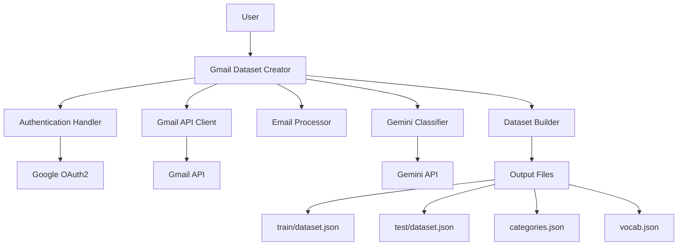

# Gmail Dataset Creator - Design Document

## Overview

The Gmail Dataset Creator is a Python-based system that replaces synthetic email generation with real Gmail data collection and intelligent categorization. The system integrates Gmail API for email fetching and Gemini API for automated email classification, producing high-quality training datasets for email classification models.

## Architecture

### High-Level Architecture



### System Flow

1. **Authentication Phase**: Establish secure connection to Gmail API
2. **Email Fetching Phase**: Retrieve emails based on user-defined filters
3. **Processing Phase**: Extract and clean email content
4. **Classification Phase**: Categorize emails using Gemini API
5. **Dataset Generation Phase**: Create structured training/test datasets

## Components and Interfaces

### 1. Authentication Handler

**Purpose**: Manages OAuth2 authentication with Gmail API

**Key Methods**:
```python
class AuthenticationHandler:
    def authenticate() -> bool
    def get_credentials() -> Credentials
    def refresh_token() -> bool
    def is_authenticated() -> bool
    def revoke_access() -> bool
```

**Configuration**:
- OAuth2 client credentials (client_id, client_secret)
- Scopes: `gmail.readonly`
- Token storage location
- Refresh token management

### 2. Gmail API Client

**Purpose**: Interfaces with Gmail API to fetch email data

**Key Methods**:
```python
class GmailAPIClient:
    def __init__(credentials: Credentials)
    def list_messages(query: str, max_results: int) -> List[str]
    def get_message(message_id: str) -> Dict
    def get_messages_batch(message_ids: List[str]) -> List[Dict]
    def handle_rate_limits() -> None
```

**Features**:
- Batch processing for efficiency
- Rate limit handling with exponential backoff
- Query filtering (date ranges, senders, labels)
- Pagination support for large datasets

### 3. Email Processor

**Purpose**: Extracts and preprocesses email content

**Key Methods**:
```python
class EmailProcessor:
    def extract_content(raw_message: Dict) -> EmailData
    def clean_html(html_content: str) -> str
    def anonymize_content(content: str) -> str
    def validate_email(email_data: EmailData) -> bool
```

**Data Structure**:
```python
@dataclass
class EmailData:
    id: str
    subject: str
    body: str
    sender: str
    recipient: str
    timestamp: datetime
    raw_content: str
```

### 4. Gemini Classifier

**Purpose**: Categorizes emails using Google's Gemini API

**Key Methods**:
```python
class GeminiClassifier:
    def __init__(api_key: str)
    def classify_email(email_data: EmailData) -> ClassificationResult
    def classify_batch(emails: List[EmailData]) -> List[ClassificationResult]
    def get_confidence_score(classification: str) -> float
```

**Classification Prompt Template**:
```
Classify this email into one of these categories: newsletter, work, personal, spam, promotional, social, finance, travel, shopping, other.

Subject: {subject}
Body: {body_preview}
Sender: {sender_domain}

Return only the category name and confidence score (0-1).
```

**Categories**:
- newsletter (0), work (1), personal (2), spam (3), promotional (4)
- social (5), finance (6), travel (7), shopping (8), other (9)

### 5. Dataset Builder

**Purpose**: Creates structured datasets from processed emails

**Key Methods**:
```python
class DatasetBuilder:
    def __init__(output_path: str, train_ratio: float = 0.8)
    def add_email(email_data: EmailData, category: str) -> None
    def build_vocabulary() -> Dict[str, int]
    def create_train_test_split() -> Tuple[List, List]
    def export_datasets() -> bool
```

**Output Format** (matching existing structure):
```json
{
    "id": "email_001",
    "subject": "Meeting Tomorrow",
    "body": "Don't forget about our meeting...",
    "sender": "manager@company.com",
    "recipient": "user@example.com",
    "category": "work",
    "language": "en"
}
```

### 6. Configuration Manager

**Purpose**: Manages system configuration and user preferences

**Configuration Schema**:
```yaml
gmail_api:
  credentials_file: "credentials.json"
  token_file: "token.json"
  scopes: ["https://www.googleapis.com/auth/gmail.readonly"]

gemini_api:
  api_key: "${GEMINI_API_KEY}"
  model: "gemini-pro"
  max_tokens: 1000

dataset:
  output_path: "./gmail_dataset"
  train_ratio: 0.8
  min_emails_per_category: 10
  max_emails_total: 1000

filters:
  date_range:
    start: "2023-01-01"
    end: "2024-12-31"
  exclude_labels: ["TRASH", "SPAM"]
  include_labels: ["INBOX"]

privacy:
  anonymize_senders: true
  exclude_personal: false
  remove_attachments: true
```

## Data Models

### Email Categories
```python
CATEGORIES = {
    "newsletter": 0,
    "work": 1,
    "personal": 2,
    "spam": 3,
    "promotional": 4,
    "social": 5,
    "finance": 6,
    "travel": 7,
    "shopping": 8,
    "other": 9
}
```

### Classification Result
```python
@dataclass
class ClassificationResult:
    category: str
    confidence: float
    reasoning: str
    needs_review: bool
```

### Dataset Statistics
```python
@dataclass
class DatasetStats:
    total_emails: int
    categories_distribution: Dict[str, int]
    train_count: int
    test_count: int
    vocabulary_size: int
    processing_time: float
```

## Error Handling

### Gmail API Errors
- **Rate Limiting**: Exponential backoff with jitter
- **Authentication Errors**: Automatic token refresh, re-authentication prompt
- **Network Errors**: Retry with circuit breaker pattern
- **Quota Exceeded**: Pause and resume functionality

### Gemini API Errors
- **Rate Limiting**: Queue-based processing with delays
- **Content Policy Violations**: Skip email with logging
- **API Errors**: Fallback to rule-based classification
- **Timeout Errors**: Retry with shorter content

### Data Processing Errors
- **Malformed Emails**: Skip with detailed logging
- **Encoding Issues**: Multiple encoding detection attempts
- **Empty Content**: Handle gracefully with placeholder content
- **Large Emails**: Truncate content while preserving structure

## Testing Strategy

### Unit Tests
- Authentication flow testing with mock credentials
- Email processing with various email formats
- Gemini API integration with mock responses
- Dataset building with known email samples

### Integration Tests
- End-to-end workflow with test Gmail account
- API rate limiting behavior
- Error recovery scenarios
- Dataset format validation

### Performance Tests
- Large dataset processing (1000+ emails)
- Memory usage monitoring
- API call optimization
- Concurrent processing validation

### Security Tests
- Token storage security
- Data anonymization verification
- API key protection
- Sensitive data handling

## Deployment Considerations

### Dependencies
```
google-auth-oauthlib>=1.0.0
google-auth-httplib2>=0.1.0
google-api-python-client>=2.0.0
google-generativeai>=0.3.0
beautifulsoup4>=4.12.0
python-dateutil>=2.8.0
pyyaml>=6.0
```

### Environment Variables
```bash
GEMINI_API_KEY=your_gemini_api_key
GMAIL_CREDENTIALS_PATH=./credentials.json
OUTPUT_PATH=./gmail_dataset
```

### File Structure
```
gmail_dataset_creator/
├── __init__.py
├── main.py
├── auth/
│   ├── __init__.py
│   └── authentication.py
├── gmail/
│   ├── __init__.py
│   └── client.py
├── processing/
│   ├── __init__.py
│   ├── email_processor.py
│   └── gemini_classifier.py
├── dataset/
│   ├── __init__.py
│   └── builder.py
├── config/
│   ├── __init__.py
│   └── manager.py
└── utils/
    ├── __init__.py
    ├── logging.py
    └── helpers.py
```

### Usage Example
```python
from gmail_dataset_creator import GmailDatasetCreator

# Initialize with configuration
creator = GmailDatasetCreator(
    config_path="config.yaml",
    output_path="./gmail_dataset"
)

# Authenticate with Gmail
creator.authenticate()

# Create dataset
stats = creator.create_dataset(
    max_emails=1000,
    date_range=("2023-01-01", "2024-12-31")
)

print(f"Created dataset with {stats.total_emails} emails")
```