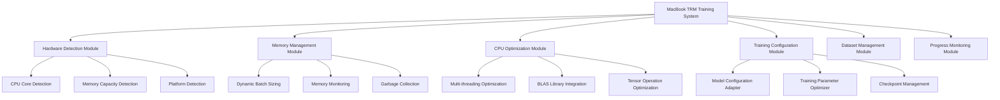

# Design Document

## Overview

This design document outlines the optimization strategy for training Tiny Recursive Models (TRM) on MacBook hardware with limited resources. The solution focuses on memory efficiency, CPU optimization, and intelligent resource management to enable local training of the 7M parameter TRM model on Intel-based MacBooks.

The design addresses the core challenge of adapting a GPU-centric training pipeline to work efficiently on CPU-only hardware with memory constraints, while maintaining the recursive reasoning capabilities that make TRM effective.

## Architecture

### System Components



### Core Architecture Principles

1. **Resource-Aware Configuration**: Automatically detect and adapt to MacBook hardware limitations
2. **Memory-First Design**: Prioritize memory efficiency over training speed
3. **CPU Optimization**: Leverage Intel-specific optimizations and multi-core processing
4. **Graceful Degradation**: Reduce model complexity when necessary to fit hardware constraints
5. **Progress Preservation**: Robust checkpointing to handle training interruptions

## Components and Interfaces

### 1. Hardware Detection Module

**Purpose**: Automatically detect MacBook hardware specifications and capabilities.

**Interface**:
```python
class HardwareDetector:
    def detect_cpu_specs() -> CPUSpecs
    def detect_memory_specs() -> MemorySpecs
    def detect_platform_capabilities() -> PlatformCapabilities
    def get_optimal_worker_count() -> int
```

**Implementation Details**:
- Use `psutil` for cross-platform hardware detection
- Detect Intel-specific features (AVX, MKL compatibility)
- Determine optimal thread count based on CPU cores and hyperthreading
- Monitor thermal throttling capabilities

### 2. Memory Management Module

**Purpose**: Dynamically manage memory usage to prevent OOM errors and optimize performance.

**Interface**:
```python
class MemoryManager:
    def calculate_optimal_batch_size(model_size: int, available_memory: int) -> int
    def monitor_memory_usage() -> MemoryStats
    def trigger_garbage_collection() -> None
    def adjust_batch_size_dynamically(current_usage: float) -> int
```

**Implementation Details**:
- Monitor memory usage in real-time using `psutil`
- Implement dynamic batch size adjustment based on memory pressure
- Use memory-mapped datasets for large data that doesn't fit in RAM
- Implement gradient accumulation for effective larger batch sizes

### 3. CPU Optimization Module

**Purpose**: Optimize tensor operations and training for Intel CPU architecture.

**Interface**:
```python
class CPUOptimizer:
    def configure_torch_threads() -> None
    def setup_mkl_optimization() -> None
    def optimize_tensor_operations() -> None
    def configure_dataloader_workers() -> int
```

**Implementation Details**:
- Configure PyTorch to use Intel MKL-DNN for optimized operations
- Set optimal thread counts for BLAS operations
- Use Intel-optimized PyTorch when available
- Implement mixed precision training with CPU-compatible dtypes

### 4. Training Configuration Module

**Purpose**: Adapt TRM training parameters for MacBook hardware constraints.

**Interface**:
```python
class TrainingConfigAdapter:
    def adapt_model_config(base_config: dict, hardware_specs: HardwareSpecs) -> dict
    def calculate_training_parameters(dataset_size: int, hardware_specs: HardwareSpecs) -> TrainingParams
    def validate_configuration(config: dict) -> ValidationResult
```

**Implementation Details**:
- Reduce model complexity if memory constraints are too tight
- Adjust learning rates for smaller batch sizes
- Configure gradient accumulation steps
- Set appropriate checkpoint intervals

### 5. Dataset Management Module

**Purpose**: Efficiently load and preprocess datasets within memory constraints.

**Interface**:
```python
class DatasetManager:
    def create_memory_efficient_dataloader(dataset_path: str, batch_size: int) -> DataLoader
    def implement_data_streaming(dataset_path: str) -> StreamingDataset
    def preprocess_and_cache(dataset_path: str, cache_dir: str) -> None
```

**Implementation Details**:
- Use memory-mapped files for large datasets
- Implement efficient data streaming with prefetching
- Cache preprocessed data to reduce CPU overhead
- Use smaller datasets for initial experimentation

## Data Models

### Hardware Specifications
```python
@dataclass
class CPUSpecs:
    cores: int
    threads: int
    architecture: str  # "x86_64"
    features: List[str]  # ["AVX2", "SSE4.2", etc.]
    base_frequency: float
    max_frequency: float

@dataclass
class MemorySpecs:
    total_memory: int  # bytes
    available_memory: int  # bytes
    memory_type: str  # "LPDDR3"
    memory_speed: int  # MHz

@dataclass
class PlatformCapabilities:
    has_mkl: bool
    has_accelerate: bool  # macOS Accelerate framework
    torch_version: str
    optimal_dtype: torch.dtype
```

### Training Configuration
```python
@dataclass
class OptimizedTrainingConfig:
    # Model parameters
    batch_size: int
    gradient_accumulation_steps: int
    max_sequence_length: int
    
    # Memory management
    memory_limit_mb: int
    enable_memory_monitoring: bool
    dynamic_batch_sizing: bool
    
    # CPU optimization
    num_workers: int
    pin_memory: bool
    use_mkl: bool
    
    # Training parameters
    learning_rate: float
    weight_decay: float
    warmup_steps: int
    max_steps: int
    
    # Checkpointing
    checkpoint_interval: int
    max_checkpoints_to_keep: int
```

## Error Handling

### Memory Management Errors
- **Out of Memory**: Automatically reduce batch size and retry
- **Memory Pressure**: Trigger garbage collection and adjust parameters
- **Dataset Too Large**: Switch to streaming mode or suggest data reduction

### CPU Performance Errors
- **Thermal Throttling**: Reduce batch size and add cooling delays
- **Thread Contention**: Adjust worker count and thread allocation
- **Slow Training**: Suggest model complexity reduction

### Configuration Errors
- **Invalid Parameters**: Provide hardware-appropriate alternatives
- **Incompatible Settings**: Auto-correct with warnings
- **Missing Dependencies**: Guide user through installation

## Testing Strategy

### Unit Testing
- Hardware detection accuracy across different MacBook models
- Memory calculation correctness for various model sizes
- CPU optimization configuration validation
- Training parameter adaptation logic

### Integration Testing
- End-to-end training pipeline with small datasets
- Memory management under various load conditions
- CPU optimization effectiveness measurement
- Checkpoint saving and loading functionality

### Performance Testing
- Training speed benchmarks on different MacBook configurations
- Memory usage profiling during training
- CPU utilization optimization validation
- Comparison with baseline (unoptimized) training

### Compatibility Testing
- Different macOS versions (10.15+)
- Various Intel MacBook models (2017-2020)
- Different PyTorch versions
- MKL and Accelerate framework integration

## Implementation Considerations

### Memory Optimization Strategies
1. **Gradient Checkpointing**: Trade computation for memory
2. **Mixed Precision**: Use float16 where possible on CPU
3. **Model Sharding**: Split model across training steps if needed
4. **Efficient Data Loading**: Use memory mapping and streaming

### CPU Performance Optimization
1. **Intel MKL Integration**: Leverage optimized BLAS operations
2. **Thread Pool Management**: Optimal thread allocation
3. **Vectorization**: Ensure operations use SIMD instructions
4. **Cache Optimization**: Minimize memory access patterns

### Training Stability
1. **Dynamic Learning Rate**: Adjust for smaller batch sizes
2. **Gradient Clipping**: Prevent instability with limited precision
3. **Regular Checkpointing**: Prevent loss of progress
4. **Progress Monitoring**: Real-time feedback on training health

### User Experience
1. **Automatic Configuration**: Minimal manual tuning required
2. **Clear Progress Reporting**: Memory usage, speed, ETA
3. **Helpful Error Messages**: Actionable suggestions for issues
4. **Resource Monitoring**: Real-time system resource display