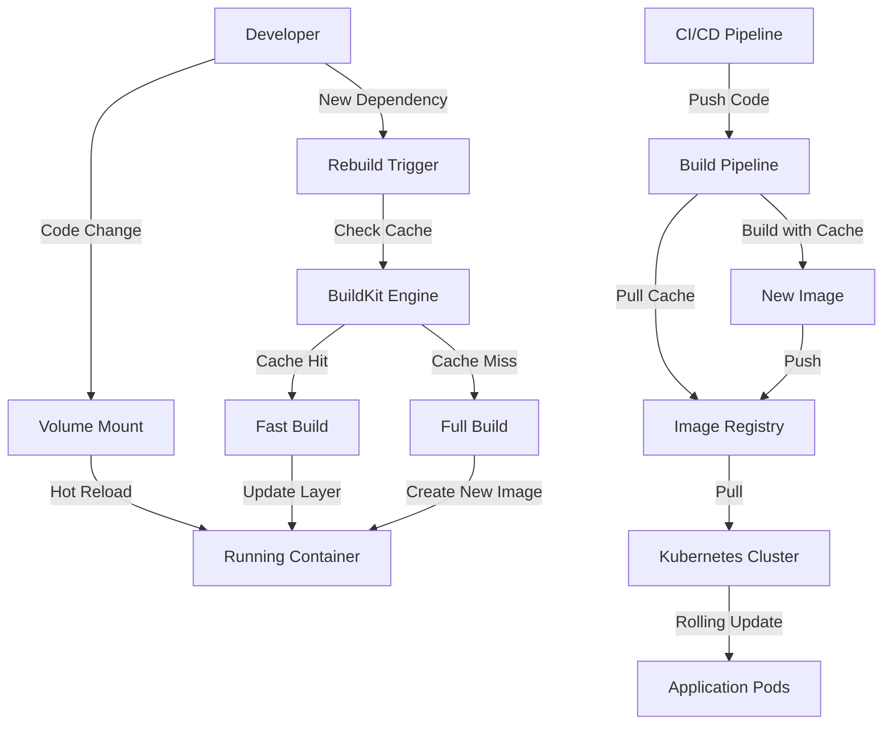

# Design Document

## Overview

Bu tasarım, Docker, Docker Compose ve Kubernetes tabanlı konteyner altyapısını optimize ederek hızlı geliştirme döngüsü, minimum konteyner boyutu ve maksimum cache verimliliği sağlar. Sistem, multi-stage build, BuildKit cache, layer optimization ve environment-specific configuration kullanarak hem development hem production ortamlarında optimal performans sunar.

Temel yaklaşım:
- **BuildKit Integration**: Docker'ın gelişmiş build motoru ile paralel build ve gelişmiş cache
- **Multi-stage Builds**: Development ve production için ayrı optimize edilmiş stage'ler
- **Layer Optimization**: Cache hit rate'i maksimize etmek için akıllı layer sıralaması
- **Volume Strategy**: Development'ta hot reload, production'da immutable artifacts
- **Registry Cache**: CI/CD pipeline'ında cache persistence için registry-based cache

## Architecture

### High-Level Architecture

```
┌─────────────────────────────────────────────────────────────┐
│                     Development Environment                  │
├─────────────────────────────────────────────────────────────┤
│  Docker Compose                                              │
│  ┌──────────────┐  ┌──────────────┐  ┌──────────────┐      │
│  │   Backend    │  │   Frontend   │  │  PostgreSQL  │      │
│  │  (Hot Reload)│  │  (Hot Reload)│  │    Redis     │      │
│  │              │  │              │  │              │      │
│  │  Volume Mount│  │  Volume Mount│  │  Named Volume│      │
│  └──────────────┘  └──────────────┘  └──────────────┘      │
└─────────────────────────────────────────────────────────────┘

┌─────────────────────────────────────────────────────────────┐
│                    Production Environment                    │
├─────────────────────────────────────────────────────────────┤
│  Kubernetes Cluster                                          │
│  ┌──────────────────────────────────────────────────────┐   │
│  │  Ingress Controller (NGINX)                          │   │
│  └──────────────────────────────────────────────────────┘   │
│  ┌──────────────┐  ┌──────────────┐  ┌──────────────┐      │
│  │   Backend    │  │   Frontend   │  │  PostgreSQL  │      │
│  │   Pods       │  │   Pods       │  │  StatefulSet │      │
│  │  (Replicas)  │  │  (Replicas)  │  │    Redis     │      │
│  │              │  │              │  │  StatefulSet │      │
│  │  HPA Enabled │  │  HPA Enabled │  │              │      │
│  └──────────────┘  └──────────────┘  └──────────────┘      │
└─────────────────────────────────────────────────────────────┘

┌─────────────────────────────────────────────────────────────┐
│                      Build Pipeline                          │
├─────────────────────────────────────────────────────────────┤
│  BuildKit + Registry Cache                                   │
│  ┌──────────────────────────────────────────────────────┐   │
│  │  1. Base Layer (Cached)                              │   │
│  │  2. System Dependencies (Cached)                     │   │
│  │  3. Application Dependencies (Cached if unchanged)   │   │
│  │  4. Application Code (Always rebuilt)                │   │
│  └──────────────────────────────────────────────────────┘   │
└─────────────────────────────────────────────────────────────┘
```

### Component Interaction Flow



## Components and Interfaces

### 1. Dockerfile Optimization

#### Backend Dockerfile Structure

```dockerfile
# Syntax for BuildKit
# syntax=docker/dockerfile:1.4

# Base stage - minimal dependencies
FROM python:3.10-slim as base
ENV PYTHONUNBUFFERED=1 \
    PYTHONDONTWRITEBYTECODE=1 \
    PIP_NO_CACHE_DIR=1

# Dependencies stage - cached layer
FROM base as dependencies
WORKDIR /app
# Copy only dependency files first (cache optimization)
COPY requirements.txt requirements-dev.txt ./
RUN --mount=type=cache,target=/root/.cache/pip \
    pip install --upgrade pip

# Development stage
FROM dependencies as development
RUN --mount=type=cache,target=/root/.cache/pip \
    pip install -r requirements-dev.txt
COPY . .
CMD ["uvicorn", "app.main:app", "--reload", "--host", "0.0.0.0"]

# Builder stage - compile dependencies
FROM dependencies as builder
RUN --mount=type=cache,target=/root/.cache/pip \
    pip install -r requirements.txt --target=/app/packages

# Production stage - minimal final image
FROM python:3.10-slim as production
ENV PYTHONUNBUFFERED=1 \
    PYTHONDONTWRITEBYTECODE=1 \
    PATH="/app/packages/bin:$PATH" \
    PYTHONPATH="/app/packages"

WORKDIR /app
# Copy only compiled packages
COPY --from=builder /app/packages /app/packages
COPY . .

# Security: non-root user
RUN useradd -m -u 1000 appuser && \
    chown -R appuser:appuser /app
USER appuser

CMD ["uvicorn", "app.main:app", "--host", "0.0.0.0", "--workers", "4"]
```

#### Frontend Dockerfile Structure

```dockerfile
# syntax=docker/dockerfile:1.4

FROM node:20-alpine as base
WORKDIR /app

# Dependencies stage
FROM base as dependencies
COPY package.json package-lock.json ./
RUN --mount=type=cache,target=/root/.npm \
    npm ci

# Development stage
FROM dependencies as development
COPY . .
CMD ["npm", "run", "dev", "--", "--host"]

# Builder stage
FROM dependencies as builder
COPY . .
RUN --mount=type=cache,target=/root/.npm \
    npm run build

# Production stage - nginx serving
FROM nginx:alpine as production
COPY --from=builder /app/dist /usr/share/nginx/html
COPY nginx.conf /etc/nginx/conf.d/default.conf

# Security: non-root user
RUN chown -R nginx:nginx /usr/share/nginx/html && \
    chown -R nginx:nginx /var/cache/nginx && \
    touch /var/run/nginx.pid && \
    chown nginx:nginx /var/run/nginx.pid
USER nginx

EXPOSE 80
CMD ["nginx", "-g", "daemon off;"]
```

### 2. Docker Compose Configuration

#### Development Compose File

```yaml
version: '3.8'

services:
  backend:
    build:
      context: ./backend
      target: development
      cache_from:
        - ${REGISTRY}/backend:cache
      args:
        BUILDKIT_INLINE_CACHE: 1
    volumes:
      # Hot reload: mount source code
      - ./backend:/app
      # Exclude dependencies from mount
      - /app/__pycache__
      - backend-packages:/root/.cache/pip
    environment:
      - ENVIRONMENT=development
      - LOG_LEVEL=DEBUG
    depends_on:
      postgres:
        condition: service_healthy
      redis:
        condition: service_healthy

  frontend:
    build:
      context: ./frontend
      target: development
      cache_from:
        - ${REGISTRY}/frontend:cache
      args:
        BUILDKIT_INLINE_CACHE: 1
    volumes:
      # Hot reload: mount source code
      - ./frontend:/app
      # Persist node_modules in named volume
      - frontend-node-modules:/app/node_modules
    environment:
      - VITE_HMR_HOST=localhost

  postgres:
    image: postgres:15-alpine
    volumes:
      - postgres-data:/var/lib/postgresql/data
    healthcheck:
      test: ["CMD-SHELL", "pg_isready"]
      interval: 5s
      timeout: 3s
      retries: 5

  redis:
    image: redis:7-alpine
    volumes:
      - redis-data:/data
    healthcheck:
      test: ["CMD", "redis-cli", "ping"]
      interval: 5s
      timeout: 3s
      retries: 5

volumes:
  backend-packages:
  frontend-node-modules:
  postgres-data:
  redis-data:
```

#### Production Compose File

```yaml
version: '3.8'

services:
  backend:
    build:
      context: ./backend
      target: production
      cache_from:
        - ${REGISTRY}/backend:latest
        - ${REGISTRY}/backend:cache
    image: ${REGISTRY}/backend:${VERSION}
    restart: unless-stopped
    deploy:
      resources:
        limits:
          cpus: '2'
          memory: 4G
        reservations:
          cpus: '1'
          memory: 2G

  frontend:
    build:
      context: ./frontend
      target: production
      cache_from:
        - ${REGISTRY}/frontend:latest
        - ${REGISTRY}/frontend:cache
    image: ${REGISTRY}/frontend:${VERSION}
    restart: unless-stopped
    deploy:
      resources:
        limits:
          cpus: '0.5'
          memory: 512M
```

### 3. BuildKit Configuration

#### .dockerignore Optimization

```
# Development files
**/__pycache__
**/*.pyc
**/.pytest_cache
**/node_modules
**/.git
**/.gitignore
**/.env*
**/README.md
**/docs

# Build artifacts
**/dist
**/build
**/.next
**/coverage

# IDE
**/.vscode
**/.idea
**/*.swp

# Logs
**/*.log
**/logs

# Keep only necessary files
!requirements.txt
!requirements-dev.txt
!package.json
!package-lock.json
```

#### BuildKit Environment Variables

```bash
# Enable BuildKit
export DOCKER_BUILDKIT=1
export COMPOSE_DOCKER_CLI_BUILD=1

# BuildKit configuration
export BUILDKIT_PROGRESS=plain
export BUILDKIT_COLORS=1
```

### 4. Kubernetes Deployment

#### Backend Deployment with Optimization

```yaml
apiVersion: apps/v1
kind: Deployment
metadata:
  name: backend
spec:
  replicas: 3
  strategy:
    type: RollingUpdate
    rollingUpdate:
      maxSurge: 1
      maxUnavailable: 0
  template:
    spec:
      containers:
      - name: backend
        image: ${REGISTRY}/backend:${VERSION}
        imagePullPolicy: IfNotPresent  # Cache optimization
        resources:
          requests:
            cpu: 500m
            memory: 1Gi
          limits:
            cpu: 2000m
            memory: 4Gi
        livenessProbe:
          httpGet:
            path: /health
            port: 8000
          initialDelaySeconds: 30
          periodSeconds: 10
        readinessProbe:
          httpGet:
            path: /health/ready
            port: 8000
          initialDelaySeconds: 10
          periodSeconds: 5
```

#### HorizontalPodAutoscaler

```yaml
apiVersion: autoscaling/v2
kind: HorizontalPodAutoscaler
metadata:
  name: backend-hpa
spec:
  scaleTargetRef:
    apiVersion: apps/v1
    kind: Deployment
    name: backend
  minReplicas: 2
  maxReplicas: 10
  metrics:
  - type: Resource
    resource:
      name: cpu
      target:
        type: Utilization
        averageUtilization: 70
  - type: Resource
    resource:
      name: memory
      target:
        type: Utilization
        averageUtilization: 80
```

### 5. CI/CD Integration

#### GitHub Actions with Cache

```yaml
name: Build and Push

on:
  push:
    branches: [main, develop]

env:
  REGISTRY: ghcr.io
  BUILDKIT_PROGRESS: plain

jobs:
  build:
    runs-on: ubuntu-latest
    steps:
      - uses: actions/checkout@v3
      
      - name: Set up Docker Buildx
        uses: docker/setup-buildx-action@v2
        with:
          driver-opts: |
            image=moby/buildkit:latest
            network=host
      
      - name: Login to Registry
        uses: docker/login-action@v2
        with:
          registry: ${{ env.REGISTRY }}
          username: ${{ github.actor }}
          password: ${{ secrets.GITHUB_TOKEN }}
      
      - name: Build and Push Backend
        uses: docker/build-push-action@v4
        with:
          context: ./backend
          target: production
          push: true
          tags: |
            ${{ env.REGISTRY }}/backend:latest
            ${{ env.REGISTRY }}/backend:${{ github.sha }}
          cache-from: |
            type=registry,ref=${{ env.REGISTRY }}/backend:cache
          cache-to: |
            type=registry,ref=${{ env.REGISTRY }}/backend:cache,mode=max
          build-args: |
            BUILDKIT_INLINE_CACHE=1
```

## Data Models

### Build Cache Structure

```typescript
interface BuildCache {
  layerId: string;
  digest: string;
  size: number;
  createdAt: Date;
  dependencies: string[];  // Files that affect this layer
  cacheKey: string;        // Hash of dependencies
}

interface CacheStrategy {
  type: 'inline' | 'registry' | 'local';
  maxAge: number;          // Cache TTL in seconds
  compressionLevel: number;
}
```

### Container Configuration

```typescript
interface ContainerConfig {
  environment: 'development' | 'production';
  buildTarget: string;
  volumes: VolumeMount[];
  resources: ResourceLimits;
  healthCheck: HealthCheckConfig;
}

interface VolumeMount {
  source: string;
  target: string;
  type: 'bind' | 'volume' | 'tmpfs';
  readOnly: boolean;
}

interface ResourceLimits {
  cpuLimit: string;
  memoryLimit: string;
  cpuRequest: string;
  memoryRequest: string;
}
```

### Deployment Strategy

```typescript
interface DeploymentStrategy {
  type: 'RollingUpdate' | 'Recreate' | 'BlueGreen';
  maxSurge: number;
  maxUnavailable: number;
  progressDeadlineSeconds: number;
  minReadySeconds: number;
}

interface ImagePullPolicy {
  policy: 'Always' | 'IfNotPresent' | 'Never';
  imagePullSecrets: string[];
}
```

## Correctness Properties

*A property is a characteristic or behavior that should hold true across all valid executions of a system-essentially, a formal statement about what the system should do. Properties serve as the bridge between human-readable specifications and machine-verifiable correctness guarantees.*

### Property 1: Health Check Success After Startup
*For any* service configuration, when all services complete startup, all health checks should return success status.
**Validates: Requirements 1.3**

### Property 2: Default Configuration Fallback
*For any* missing environment variable in development mode, the system should use predefined default values and continue operation.
**Validates: Requirements 1.4**

### Property 3: Error Message Clarity
*For any* startup error condition, the system should produce error messages containing both the error description and actionable resolution steps.
**Validates: Requirements 1.5**

### Property 4: Selective Service Restart
*For any* configuration file change, only services that depend on that configuration should restart, while other services remain running.
**Validates: Requirements 2.3**

### Property 5: Layer-Specific Cache Invalidation
*For any* dependency file change (package.json, requirements.txt), only the dependency installation layer should be rebuilt, preserving cache for unchanged layers.
**Validates: Requirements 2.4**

### Property 6: Volume Mount Synchronization
*For any* file modification in a volume-mounted directory, the change should be visible in both host and container filesystems immediately.
**Validates: Requirements 2.5**

### Property 7: Runtime-Only Dependencies in Production
*For any* production image, the final image should contain only runtime dependencies and exclude all build-time and development dependencies.
**Validates: Requirements 3.3, 5.5, 9.5**

### Property 8: Image Cleanup Completeness
*For any* optimized image, the image should not contain temporary files, package manager caches, or build artifacts.
**Validates: Requirements 3.4**

### Property 9: System Dependencies Availability
*For any* alpine-based image, all system-level dependencies required for application runtime should be present and functional.
**Validates: Requirements 3.5**

### Property 10: Layer Ordering for Cache Efficiency
*For any* Dockerfile, layers containing frequently changing content (application code) should appear after layers containing rarely changing content (system packages, dependencies).
**Validates: Requirements 4.1**

### Property 11: Dependency Cache Reuse
*For any* build where dependency files remain unchanged, the dependency installation layer should be loaded from cache without re-execution.
**Validates: Requirements 4.2, 9.1**

### Property 12: Incremental Layer Rebuild
*For any* incremental build, only layers affected by file changes should be rebuilt, while unaffected layers should be reused from cache.
**Validates: Requirements 4.5**

### Property 13: Environment-Specific Configuration Loading
*For any* environment variable or .env file, the configuration should be correctly loaded and accessible to the application at runtime.
**Validates: Requirements 5.4**

### Property 14: Service Dependency Ordering
*For any* service with health check dependencies, the dependent service should not start until all dependency health checks pass.
**Validates: Requirements 6.2**

### Property 15: Service Isolation on Restart
*For any* single service restart operation, other running services should maintain their state and continue operation without interruption.
**Validates: Requirements 6.3**

### Property 16: Resource Limit Enforcement
*For any* container with defined CPU or memory limits, the container runtime should enforce these limits and prevent resource usage beyond specified thresholds.
**Validates: Requirements 6.5**

### Property 17: Image Pull Policy Cache Optimization
*For any* Kubernetes deployment with IfNotPresent pull policy, images should be pulled from registry only when not present in local cache.
**Validates: Requirements 7.2**

### Property 18: Pod Health Probe Configuration
*For any* Kubernetes pod specification, both readiness and liveness probes should be defined with appropriate endpoints and timing parameters.
**Validates: Requirements 7.3**

### Property 19: Config Change Triggers Pod Restart
*For any* ConfigMap or Secret modification, pods consuming that configuration should automatically restart to load new values.
**Validates: Requirements 7.5**

### Property 20: CI Pipeline Cache Utilization
*For any* CI/CD build, the build process should attempt to load cache from previous builds before executing build steps.
**Validates: Requirements 8.1**

### Property 21: Registry Cache Persistence
*For any* build with registry-based cache enabled, cache layers should be pushed to the registry after successful build completion.
**Validates: Requirements 8.2**

### Property 22: Cache Key Dependency Hashing
*For any* cache key generation, the key should be derived from content hashes of dependency files to ensure cache invalidation on changes.
**Validates: Requirements 8.4**

### Property 23: Dependency Version Cache Invalidation
*For any* dependency version change in package.json or requirements.txt, the dependency cache should be invalidated and dependencies reinstalled.
**Validates: Requirements 9.4**

### Property 24: Health Check Failure Logging
*For any* failed health check, the system should log detailed error information including the check type, endpoint, and failure reason.
**Validates: Requirements 10.2**

### Property 25: Container Restart Reason Logging
*For any* container restart event, the system should log the restart reason (crash, OOM, manual, config change) with timestamp.
**Validates: Requirements 10.3**

### Property 26: Resource Limit Exceeded Warning
*For any* resource usage approaching or exceeding defined limits, the system should emit warning logs or metrics.
**Validates: Requirements 10.4**

### Property 27: Selective Microservice Build
*For any* code change in a monorepo, only the microservice containing the changed files should trigger a rebuild.
**Validates: Requirements 11.1**

### Property 28: Build Dependency Graph Resolution
*For any* set of microservices with inter-dependencies, the build system should determine and execute builds in correct dependency order.
**Validates: Requirements 11.2**

### Property 29: Shared Library Change Propagation
*For any* shared library modification, all microservices that depend on that library should be identified and rebuilt.
**Validates: Requirements 11.4**

### Property 30: Selective Service Deployment
*For any* deployment operation, only services with changed images should be deployed, while unchanged services remain untouched.
**Validates: Requirements 11.5**

### Property 31: Non-Root User Execution
*For any* production container, the main process should run as a non-root user with UID greater than 0.
**Validates: Requirements 12.1**

### Property 32: Build Secret Exclusion
*For any* final production image, build-time secrets (API keys, tokens, passwords) should not be present in any layer.
**Validates: Requirements 12.3**

### Property 33: Least Privilege File Permissions
*For any* file in the production image, permissions should be set to the minimum required for operation (no unnecessary write or execute permissions).
**Validates: Requirements 12.5**


## Error Handling

### Build Errors

**Cache Miss Handling**
- When cache is unavailable, fall back to full build
- Log cache miss reason for debugging
- Continue build process without blocking

**Dependency Resolution Failures**
- Retry with exponential backoff (3 attempts)
- Provide clear error messages with package name and version
- Suggest checking network connectivity and registry availability

**Multi-stage Build Failures**
- Identify which stage failed
- Preserve intermediate layers for debugging
- Provide stage-specific error context

### Runtime Errors

**Container Startup Failures**
- Implement health check retries with configurable intervals
- Log startup errors with full stack traces in development
- Provide graceful degradation for dependent services

**Volume Mount Issues**
- Validate volume paths before container start
- Check file permissions and ownership
- Provide clear error messages for permission denied errors

**Resource Exhaustion**
- Implement resource monitoring and alerting
- Gracefully handle OOM situations with proper logging
- Trigger autoscaling when thresholds are approached

### Configuration Errors

**Invalid Environment Variables**
- Validate required environment variables at startup
- Provide default values where appropriate
- Fail fast with clear error messages for critical missing configs

**Malformed Configuration Files**
- Validate YAML/JSON syntax before applying
- Provide line numbers and error context
- Suggest corrections for common mistakes

## Testing Strategy

### Unit Testing

**Dockerfile Validation**
- Test Dockerfile syntax and structure
- Verify layer ordering follows best practices
- Check for security anti-patterns (running as root, exposed secrets)

**Configuration Validation**
- Test docker-compose.yml syntax
- Verify Kubernetes manifest validity
- Check environment variable interpolation

**Script Testing**
- Test build scripts with various scenarios
- Verify cache key generation logic
- Test deployment scripts with dry-run mode

### Property-Based Testing

This project will use **pytest with Hypothesis** for Python-based tests and **Docker SDK for Python** for container interaction testing.

**Configuration Requirements:**
- Each property-based test should run a minimum of 100 iterations
- Each test must include a comment explicitly referencing the correctness property from this design document
- Format: `# Feature: optimized-container-infrastructure, Property X: [property text]`
- Each correctness property must be implemented by a single property-based test

**Test Categories:**

1. **Cache Behavior Properties**
   - Generate random Dockerfile modifications
   - Verify cache hit/miss behavior matches expectations
   - Test cache key generation with various dependency combinations

2. **Build Optimization Properties**
   - Generate random layer orderings
   - Verify optimal ordering is maintained
   - Test incremental build behavior with various change patterns

3. **Configuration Properties**
   - Generate random environment variable combinations
   - Verify fallback to defaults works correctly
   - Test configuration validation with invalid inputs

4. **Resource Management Properties**
   - Generate random resource limit configurations
   - Verify limits are enforced correctly
   - Test behavior under resource pressure

5. **Security Properties**
   - Generate random user configurations
   - Verify non-root execution
   - Test secret exclusion from final images

**Example Property Test Structure:**

```python
from hypothesis import given, strategies as st
import docker
import pytest

# Feature: optimized-container-infrastructure, Property 11: Dependency Cache Reuse
@given(
    dependencies=st.lists(st.text(min_size=1, max_size=20), min_size=1, max_size=10),
    code_change=st.text(min_size=1, max_size=100)
)
@pytest.mark.property_test
def test_dependency_cache_reuse(dependencies, code_change):
    """
    For any build where dependency files remain unchanged,
    the dependency installation layer should be loaded from cache.
    """
    # Build 1: Initial build with dependencies
    image1, build_log1 = build_with_dependencies(dependencies)
    
    # Build 2: Change only application code, keep dependencies same
    image2, build_log2 = build_with_dependencies(dependencies, code_change)
    
    # Verify dependency layer was cached
    assert "Using cache" in build_log2
    assert dependency_layer_id(image1) == dependency_layer_id(image2)
```

### Integration Testing

**End-to-End Workflow Tests**
- Test complete development workflow (code change → hot reload → verification)
- Test production deployment workflow (build → push → deploy → verify)
- Test CI/CD pipeline with cache (build → cache → rebuild with cache)

**Service Interaction Tests**
- Test service startup order with dependencies
- Test service isolation on restart
- Test health check propagation

**Performance Tests**
- Measure cold start time (first build)
- Measure warm start time (cached build)
- Measure hot reload latency
- Verify image size constraints

### Acceptance Testing

**Development Experience Tests**
- Verify setup time is under 5 minutes
- Verify hot reload works within 2 seconds
- Verify single service restart doesn't affect others

**Production Deployment Tests**
- Verify zero-downtime rolling updates
- Verify image sizes meet constraints
- Verify resource limits are enforced

**Cache Efficiency Tests**
- Verify cache hit rate for unchanged dependencies
- Verify incremental builds only rebuild changed layers
- Verify CI/CD cache persistence across builds

## Implementation Notes

### BuildKit Best Practices

1. **Enable BuildKit by default**
   ```bash
   export DOCKER_BUILDKIT=1
   export COMPOSE_DOCKER_CLI_BUILD=1
   ```

2. **Use BuildKit syntax in Dockerfile**
   ```dockerfile
   # syntax=docker/dockerfile:1.4
   ```

3. **Leverage cache mounts**
   ```dockerfile
   RUN --mount=type=cache,target=/root/.cache/pip \
       pip install -r requirements.txt
   ```

4. **Use inline cache for CI/CD**
   ```bash
   docker build \
     --cache-from type=registry,ref=myregistry/myimage:cache \
     --cache-to type=registry,ref=myregistry/myimage:cache,mode=max \
     --build-arg BUILDKIT_INLINE_CACHE=1 \
     .
   ```

### Docker Compose Best Practices

1. **Use health checks for dependencies**
   ```yaml
   depends_on:
     postgres:
       condition: service_healthy
   ```

2. **Separate development and production configs**
   - `docker-compose.yml` for development
   - `docker-compose.prod.yml` for production
   - Use `docker-compose -f` to specify files

3. **Use named volumes for persistence**
   ```yaml
   volumes:
     - node_modules:/app/node_modules
   ```

4. **Exclude mounted directories from image**
   ```yaml
   volumes:
     - ./app:/app
     - /app/node_modules  # Exclude from mount
   ```

### Kubernetes Best Practices

1. **Use imagePullPolicy: IfNotPresent**
   ```yaml
   imagePullPolicy: IfNotPresent
   ```

2. **Implement proper probes**
   ```yaml
   livenessProbe:
     httpGet:
       path: /health
       port: 8000
     initialDelaySeconds: 30
   readinessProbe:
     httpGet:
       path: /health/ready
       port: 8000
     initialDelaySeconds: 10
   ```

3. **Use rolling updates**
   ```yaml
   strategy:
     type: RollingUpdate
     rollingUpdate:
       maxSurge: 1
       maxUnavailable: 0
   ```

4. **Configure HPA for autoscaling**
   ```yaml
   apiVersion: autoscaling/v2
   kind: HorizontalPodAutoscaler
   ```

### CI/CD Integration Best Practices

1. **Use Docker Buildx for advanced features**
   ```yaml
   - name: Set up Docker Buildx
     uses: docker/setup-buildx-action@v2
   ```

2. **Implement registry-based cache**
   ```yaml
   cache-from: type=registry,ref=${{ env.REGISTRY }}/app:cache
   cache-to: type=registry,ref=${{ env.REGISTRY }}/app:cache,mode=max
   ```

3. **Use matrix builds for multiple services**
   ```yaml
   strategy:
     matrix:
       service: [backend, frontend]
   ```

4. **Implement cache key based on dependency files**
   ```yaml
   - uses: actions/cache@v3
     with:
       path: /tmp/.buildx-cache
       key: ${{ runner.os }}-buildx-${{ hashFiles('**/requirements.txt') }}
   ```

## Performance Targets

### Build Performance

- **Cold build (no cache)**: < 10 minutes for complete stack
- **Warm build (with cache)**: < 2 minutes for complete stack
- **Incremental build (code change only)**: < 30 seconds
- **Hot reload latency**: < 2 seconds

### Image Size Targets

- **Backend production image**: < 200MB
- **Frontend production image**: < 50MB
- **Development images**: Size not critical, optimize for build speed

### Runtime Performance

- **Container startup time**: < 30 seconds
- **Health check response time**: < 1 second
- **Service restart time**: < 10 seconds
- **Complete stack startup**: < 5 minutes

### Cache Efficiency Targets

- **Cache hit rate for unchanged dependencies**: > 95%
- **Cache hit rate for unchanged base layers**: > 99%
- **CI/CD cache persistence**: 100% across builds
- **Layer reuse rate**: > 80% for incremental builds

## Monitoring and Observability

### Metrics to Track

**Build Metrics**
- Build duration by stage
- Cache hit/miss rate
- Image size by service
- Layer count and sizes

**Runtime Metrics**
- Container CPU usage
- Container memory usage
- Container restart count
- Health check success rate

**Deployment Metrics**
- Deployment duration
- Rollback count
- Pod ready time
- Image pull duration

### Logging Strategy

**Development Logging**
- Verbose logging enabled
- Colored output for readability
- Real-time log streaming
- Debug information included

**Production Logging**
- Structured JSON logging
- Log level: INFO or WARNING
- Centralized log aggregation
- Log retention policies

### Alerting

**Critical Alerts**
- Container OOM kills
- Repeated health check failures
- Deployment failures
- Image pull failures

**Warning Alerts**
- High resource usage (>80%)
- Slow build times
- Low cache hit rates
- Frequent container restarts

## Security Considerations

### Image Security

- Use minimal base images (alpine, slim)
- Run as non-root user
- Scan images for vulnerabilities
- Keep base images updated
- Remove unnecessary packages

### Secret Management

- Never include secrets in Dockerfile
- Use BuildKit secrets for build-time secrets
- Use Kubernetes Secrets for runtime secrets
- Rotate secrets regularly
- Use secret scanning tools

### Network Security

- Minimize exposed ports
- Use internal networks for service communication
- Implement network policies in Kubernetes
- Use TLS for external communication

### Access Control

- Implement RBAC in Kubernetes
- Use least privilege principles
- Audit access logs
- Implement image signing and verification
