# Design Document

## Overview

This design document outlines the architecture and implementation strategy for training a real, production-ready email classification AI model using the existing EmailTRM implementation and MacBook optimization infrastructure. The system leverages all real components already implemented in the codebase to train on actual email datasets and achieve 95%+ accuracy for deployment.

The design focuses on practical execution using the real EmailTrainingOrchestrator, actual EmailTRM model with recursive reasoning, and production email datasets to create a deployable email classifier.

## Architecture

### System Components

```mermaid
graph TB
    A[Real Email Classifier Training System] --> B[Production Email Dataset]
    A --> C[Real EmailTRM Model]
    A --> D[MacBook Training Pipeline]
    A --> E[Training Orchestrator]
    A --> F[Model Deployment]
    
    B --> G[Real Email Data Loader]
    B --> H[Email Dataset Manager]
    B --> I[Data Validation & Preprocessing]
    B --> J[Multi-language Support]
    
    C --> K[EmailTRM with Recursive Reasoning]
    C --> L[Email Structure Awareness]
    C --> M[Hierarchical Attention]
    C --> N[Adaptive Halting]
    
    D --> O[Hardware Detection]
    D --> P[Memory Optimization]
    D --> Q[CPU Optimization]
    D --> R[Resource Monitoring]
    
    E --> S[Multi-Phase Training]
    E --> T[Hyperparameter Optimization]
    E --> U[Progress Monitoring]
    E --> V[Checkpoint Management]
    
    F --> W[Model Export]
    F --> X[Production Validation]
    F --> Y[Inference API]
    F --> Z[Performance Documentation]
```



### Core Architecture Principles

1. **Real Component Utilization**: Use all existing real implementations without mocks or placeholders
2. **Production Data Focus**: Train on actual email datasets with real content and verified labels
3. **Hardware-Aware Training**: Leverage existing MacBook optimization for efficient resource usage
4. **Recursive Reasoning**: Utilize the real EmailTRM's recursive reasoning capabilities for better accuracy
5. **Deployment Readiness**: Ensure trained model is immediately usable in production applications

## Components and Interfaces

### 1. Production Email Dataset Management

**Purpose**: Handle real email datasets with actual content for training and validation.

**Key Components**:
- **RealEmailDatasetLoader**: Uses existing EmailDatasetManager to load actual email JSON files
- **EmailContentValidator**: Validates real email content quality and category labels
- **MultilingualProcessor**: Handles both English and Turkish email content
- **DatasetSplitter**: Creates proper train/validation/test splits from real data

**Interface**:
```python
class ProductionEmailDataset:
    def load_real_email_dataset(self, dataset_path: str) -> EmailDataset
    def validate_email_content(self, emails: List[Email]) -> ValidationResult
    def create_dataset_splits(self, emails: List[Email], splits: Dict[str, float]) -> Dict[str, EmailDataset]
    def get_dataset_statistics(self) -> DatasetStats
```

**Implementation Details**:
- Uses existing EmailDatasetManager for real email loading
- Supports gmail_dataset_creator format and custom email JSON formats
- Validates email content quality (non-empty subjects/bodies, valid categories)
- Creates balanced splits ensuring all categories are represented
- Handles multilingual content with appropriate tokenization

### 2. Real EmailTRM Model Integration

**Purpose**: Utilize the actual EmailTRM implementation with all its recursive reasoning capabilities.

**Key Components**:
- **EmailTRMModelManager**: Manages the real EmailTRM model lifecycle
- **RecursiveReasoningController**: Controls the recursive reasoning cycles
- **EmailStructureProcessor**: Leverages email structure awareness features
- **AdaptiveHaltingManager**: Manages the adaptive halting mechanisms

**Interface**:
```python
class RealEmailTRMTrainer:
    def initialize_email_trm(self, config: EmailTRMConfig) -> EmailTRM
    def configure_recursive_reasoning(self, cycles: int, halt_threshold: float) -> None
    def enable_email_structure_features(self, use_hierarchical: bool) -> None
    def train_with_recursive_reasoning(self, dataloader: DataLoader) -> TrainingMetrics
```

**Implementation Details**:
- Uses the actual EmailTRM class from models/recursive_reasoning/trm_email.py
- Configures recursive reasoning cycles based on hardware capabilities
- Enables email structure awareness and hierarchical attention
- Implements adaptive halting for efficient inference
- Supports confidence calibration for production use

### 3. MacBook Training Pipeline

**Purpose**: Execute training using the real MacBook optimization infrastructure.

**Key Components**:
- **RealHardwareOptimizer**: Uses existing HardwareDetector and optimization modules
- **MacBookTrainingExecutor**: Executes training with real MacBook optimizations
- **ResourceMonitoringSystem**: Real-time monitoring of MacBook resources
- **MemoryPressureHandler**: Handles real memory constraints during training

**Interface**:
```python
class MacBookTrainingPipeline:
    def detect_hardware_capabilities(self) -> HardwareSpecs
    def optimize_training_config(self, base_config: EmailTrainingConfig) -> OptimizedConfig
    def execute_optimized_training(self, model: EmailTRM, dataset: EmailDataset) -> TrainingResult
    def monitor_resource_usage(self) -> ResourceMetrics
```

**Implementation Details**:
- Uses existing HardwareDetector for automatic MacBook detection
- Applies real memory management and CPU optimization
- Implements dynamic batch sizing based on available memory
- Monitors thermal throttling and adjusts training intensity
- Provides real-time resource usage feedback

### 4. Training Orchestration System

**Purpose**: Manage the complete training workflow using the real EmailTrainingOrchestrator.

**Key Components**:
- **RealTrainingOrchestrator**: Uses existing EmailTrainingOrchestrator implementation
- **MultiPhaseTrainingManager**: Executes real multi-phase training strategies
- **HyperparameterOptimizer**: Real hyperparameter optimization using Bayesian search
- **CheckpointManager**: Real checkpoint saving and resumption

**Interface**:
```python
class RealEmailTrainingOrchestrator:
    def setup_training_environment(self, dataset_path: str) -> EnvironmentSetup
    def execute_multi_phase_training(self, phases: List[TrainingPhase]) -> TrainingResult
    def optimize_hyperparameters(self, search_space: HyperparameterSpace) -> OptimalConfig
    def manage_training_checkpoints(self, checkpoint_config: CheckpointConfig) -> None
```

**Implementation Details**:
- Uses the actual EmailTrainingOrchestrator class
- Implements real multi-phase training (warmup, main, fine-tuning)
- Provides real hyperparameter optimization with Bayesian search
- Manages real checkpoints with automatic resumption
- Integrates all real monitoring and optimization components

### 5. Model Deployment System

**Purpose**: Create production-ready model artifacts for real deployment.

**Key Components**:
- **ModelExporter**: Exports trained model for production use
- **ProductionValidator**: Validates model on real held-out data
- **InferenceAPICreator**: Creates inference API for production deployment
- **DocumentationGenerator**: Generates model documentation and usage examples

**Interface**:
```python
class ProductionModelDeployment:
    def export_production_model(self, trained_model: EmailTRM) -> ProductionModel
    def validate_production_readiness(self, model: ProductionModel, test_data: EmailDataset) -> ValidationResult
    def create_inference_api(self, model: ProductionModel) -> InferenceAPI
    def generate_model_documentation(self, model: ProductionModel, metrics: TrainingMetrics) -> Documentation
```

**Implementation Details**:
- Exports model with all necessary components for standalone inference
- Validates model performance on real held-out email data
- Creates FastAPI-based inference service for production use
- Generates comprehensive documentation with performance characteristics
- Includes confidence scoring and prediction explanations

## Data Models

### Real Email Dataset Schema
```python
@dataclass
class RealEmailSample:
    id: str
    subject: str
    body: str
    sender: str
    recipient: str
    category: str  # One of 10 real categories
    language: str  # "en" or "tr"
    timestamp: datetime
    content_length: int
    structure_complexity: float  # Measure of email structure complexity
    
@dataclass
class ProductionEmailDataset:
    samples: List[RealEmailSample]
    categories: Dict[str, int]  # Category name to ID mapping
    category_distribution: Dict[str, int]  # Category counts
    total_samples: int
    languages: List[str]
    quality_score: float  # Overall dataset quality score
    split: str  # "train", "val", "test"
```

### Real Training Configuration
```python
@dataclass
class RealEmailTrainingConfig:
    # Model parameters (using real EmailTRM)
    model_name: str = "EmailTRM"
    vocab_size: int = 5000
    hidden_size: int = 512
    num_layers: int = 2
    num_email_categories: int = 10
    
    # Real recursive reasoning parameters
    H_cycles: int = 3  # Recursive reasoning cycles
    L_cycles: int = 4  # Layer cycles
    halt_max_steps: int = 8
    halt_exploration_prob: float = 0.1
    
    # Real training parameters
    batch_size: int = 8  # Auto-adjusted for MacBook
    gradient_accumulation_steps: int = 8
    learning_rate: float = 1e-4
    weight_decay: float = 0.01
    max_epochs: int = 10
    max_steps: int = 10000
    
    # Real email-specific parameters
    max_sequence_length: int = 512
    use_email_structure: bool = True
    use_hierarchical_attention: bool = True
    subject_attention_weight: float = 2.0
    pooling_strategy: str = "weighted"
    
    # Real MacBook optimization parameters
    memory_limit_mb: int = 6000  # Auto-detected
    enable_memory_monitoring: bool = True
    dynamic_batch_sizing: bool = True
    use_cpu_optimization: bool = True
    gradient_checkpointing: bool = True
    
    # Production targets
    target_accuracy: float = 0.95
    min_category_accuracy: float = 0.90
    early_stopping_patience: int = 5
```

### Production Training Metrics
```python
@dataclass
class ProductionTrainingMetrics:
    # Real accuracy metrics
    overall_accuracy: float
    per_category_accuracy: Dict[str, float]
    confusion_matrix: np.ndarray
    f1_scores: Dict[str, float]
    precision_scores: Dict[str, float]
    recall_scores: Dict[str, float]
    
    # Real recursive reasoning metrics
    average_reasoning_cycles: float
    halt_efficiency: float  # Percentage of optimal halting decisions
    reasoning_convergence_rate: float
    
    # Real resource metrics
    peak_memory_usage_mb: float
    average_cpu_usage: float
    training_speed_samples_per_sec: float
    total_training_time_hours: float
    
    # Production readiness metrics
    inference_speed_ms: float
    model_size_mb: float
    confidence_calibration_score: float
    robustness_score: float  # Performance on challenging emails
```

## Error Handling

### Real Dataset Issues
- **Missing Email Content**: Handle emails with empty subjects or bodies using content imputation
- **Invalid Categories**: Validate all email categories against predefined schema
- **Encoding Problems**: Handle various text encodings in real email content
- **Imbalanced Categories**: Apply real balancing techniques for category distribution

### Real Model Training Issues
- **Recursive Reasoning Failures**: Handle cases where recursive reasoning doesn't converge
- **Memory Overflow**: Implement real memory pressure handling with dynamic batch sizing
- **Gradient Explosion**: Apply real gradient clipping and stability checks
- **Halting Mechanism Failures**: Provide fallback halting strategies

### Real Hardware Constraints
- **MacBook Thermal Throttling**: Detect and respond to real thermal limitations
- **Memory Pressure**: Implement real memory management with graceful degradation
- **CPU Overload**: Balance training intensity with system responsiveness
- **Disk Space Issues**: Monitor and manage checkpoint and log file sizes

### Real Production Deployment Issues
- **Model Export Failures**: Validate model serialization and loading
- **Inference Performance**: Ensure real-time inference speed requirements
- **API Integration**: Handle real API deployment and scaling issues
- **Model Drift**: Monitor model performance degradation over time

## Testing Strategy

### Real Data Testing
- Validate training on actual email datasets with verified categories
- Test model performance on diverse real email content and formats
- Validate multilingual support with real Turkish and English emails
- Test robustness with challenging and ambiguous real email examples

### Real Model Testing
- Test EmailTRM recursive reasoning with actual email classification tasks
- Validate adaptive halting mechanisms with real email complexity variations
- Test email structure awareness with actual email formats
- Validate confidence calibration with real prediction scenarios

### Real Infrastructure Testing
- Test MacBook optimization with actual hardware configurations
- Validate memory management under real training loads
- Test checkpoint saving and resumption with real training interruptions
- Validate resource monitoring accuracy during real training sessions

### Production Deployment Testing
- Test model export and loading in production environments
- Validate inference API performance with real email volumes
- Test model documentation accuracy and completeness
- Validate production monitoring and alerting systems

## Implementation Considerations

### Real Component Integration
1. **EmailTRM Utilization**: Leverage all features of the real EmailTRM implementation
2. **Orchestrator Integration**: Use the complete EmailTrainingOrchestrator workflow
3. **Hardware Optimization**: Apply all existing MacBook optimization techniques
4. **Dataset Management**: Use real EmailDatasetManager for all data operations

### Production Quality Assurance
1. **Real Data Validation**: Ensure all training data meets production quality standards
2. **Model Performance**: Achieve and maintain 95%+ accuracy on real email data
3. **Deployment Readiness**: Create models that can be immediately deployed
4. **Documentation**: Provide comprehensive documentation for production use

### MacBook Hardware Optimization
1. **Memory Efficiency**: Optimize for real MacBook memory constraints
2. **CPU Utilization**: Leverage all available CPU cores efficiently
3. **Thermal Management**: Monitor and respond to real thermal conditions
4. **Power Management**: Optimize for sustained training on battery power

### Scalability and Maintenance
1. **Model Versioning**: Implement versioning for production model updates
2. **Performance Monitoring**: Track model performance in production
3. **Retraining Pipeline**: Enable periodic retraining with new data
4. **A/B Testing**: Support testing new models against production baselines