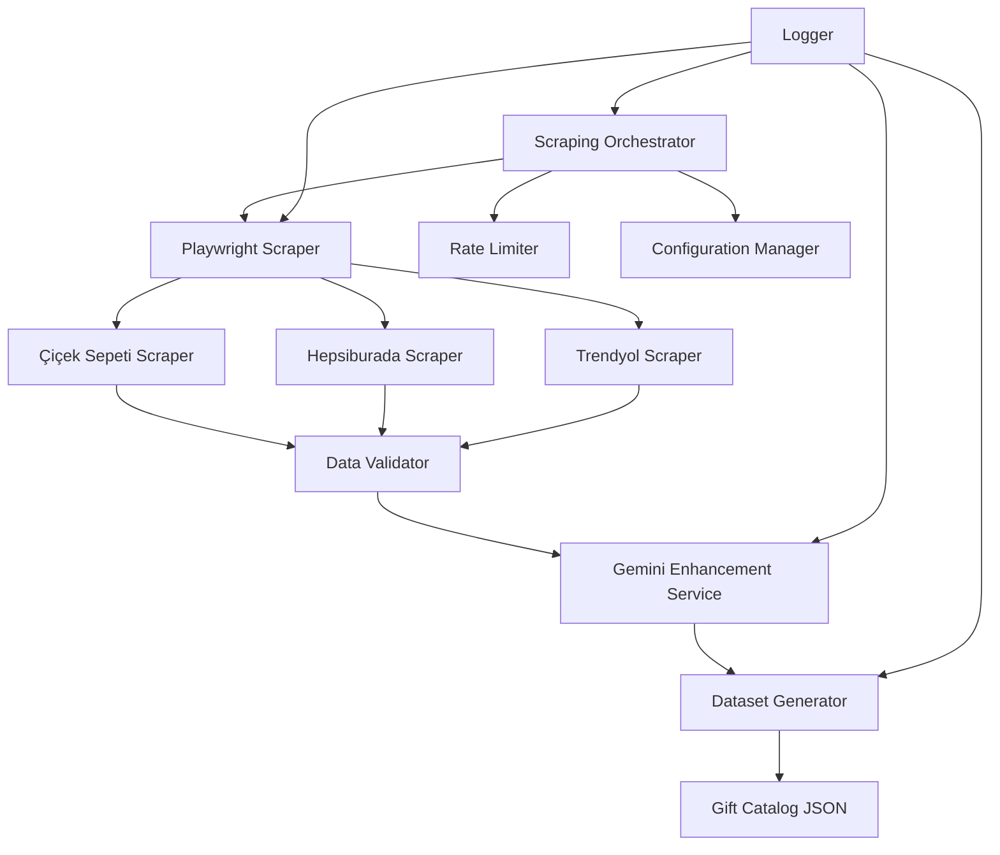

# Tasarım Dokümanı

## Genel Bakış

Bu sistem, Türkiye'deki önde gelen e-ticaret platformlarından (Çiçek Sepeti, Hepsiburada, Trendyol) gerçek ürün verilerini otomatik olarak toplayarak, hediye öneri modelinin eğitimi için yüksek kaliteli bir veri seti oluşturacaktır. Sistem, üç ana bileşenden oluşur:

1. **Web Scraping Engine**: Playwright tabanlı headless browser kullanarak ürün verilerini toplar
2. **AI Enhancement Service**: Gemini API ile verileri zenginleştirir ve kategorize eder
3. **Dataset Generator**: Toplanan verileri model eğitimi için uygun formata dönüştürür

## Mimari

### Sistem Mimarisi



### Veri Akışı

1. **Scraping Phase**: Web sitelerinden ham ürün verileri toplanır
2. **Validation Phase**: Toplanan veriler doğrulanır ve temizlenir
3. **Enhancement Phase**: Gemini API ile veriler zenginleştirilir
4. **Generation Phase**: Final veri seti oluşturulur

## Bileşenler ve Arayüzler

### 1. Configuration Manager

**Sorumluluk**: Scraping işleminin yapılandırmasını yönetir

**Yapılandırma Dosyası** (`config/scraping_config.yaml`):

```yaml
scraping:
  # Target websites
  websites:
    - name: "ciceksepeti"
      url: "https://www.ciceksepeti.com"
      enabled: true
      max_products: 500
      categories:
        - "hediye"
        - "cicek"
        - "aksesuar"
    
    - name: "hepsiburada"
      url: "https://www.hepsiburada.com"
      enabled: true
      max_products: 500
      categories:
        - "kitap"
        - "elektronik"
        - "ev-yasam"
    
    - name: "trendyol"
      url: "https://www.trendyol.com"
      enabled: true
      max_products: 500
      categories:
        - "ev-yasam"
        - "kitap"
        - "spor-outdoor"

  # Rate limiting
  rate_limit:
    requests_per_minute: 20
    delay_between_requests: [2, 5]  # Random delay in seconds
    max_concurrent_requests: 10
    
  # Browser settings
  browser:
    headless: true
    user_agents:
      - "Mozilla/5.0 (Macintosh; Intel Mac OS X 10_15_7) AppleWebKit/537.36"
      - "Mozilla/5.0 (Windows NT 10.0; Win64; x64) AppleWebKit/537.36"
    viewport:
      width: 1920
      height: 1080
    timeout: 30000  # milliseconds
    
  # Test mode
  test_mode: false
  test_products_limit: 10

# Gemini API
gemini:
  api_key_env: "GEMINI_API_KEY"
  model: "gemini-1.5-flash"
  max_requests_per_day: 1000
  retry_attempts: 3
  retry_delay: 2  # seconds
  timeout: 30
  
  # Enhancement prompts
  enhancement_prompt: |
    Analyze this product and provide structured information:
    Product Name: {name}
    Description: {description}
    Price: {price} TL
    
    Return JSON with:
    - category: main category (technology, books, cooking, art, wellness, fitness, outdoor, home, food, experience, gaming, fashion, gardening)
    - target_audience: list of target demographics
    - gift_occasions: suitable occasions (birthday, mothers_day, fathers_day, christmas, etc.)
    - emotional_tags: emotional attributes (relaxing, exciting, practical, luxury, etc.)
    - age_range: [min_age, max_age]

# Output
output:
  raw_data_path: "data/scraped_raw"
  processed_data_path: "data/scraped_processed"
  final_dataset_path: "data/scraped_gift_catalog.json"
  
# Logging
logging:
  level: "INFO"
  file: "logs/scraping.log"
  error_file: "logs/scraping_errors.log"
  verbose: false
```

**Arayüz**:
```python
class ConfigurationManager:
    def load_config(self, config_path: str) -> Dict[str, Any]
    def get_website_config(self, website_name: str) -> Dict[str, Any]
    def get_rate_limit_config(self) -> Dict[str, Any]
    def get_gemini_config(self) -> Dict[str, Any]
    def is_test_mode(self) -> bool
```

### 2. Web Scraping Engine

**Sorumluluk**: Playwright kullanarak web sitelerinden veri toplar

**Ana Bileşenler**:

#### 2.1 Base Scraper (Abstract)

```python
from abc import ABC, abstractmethod
from typing import List, Dict, Any
from playwright.async_api import Page, Browser

class BaseScraper(ABC):
    """Base class for all website scrapers"""
    
    def __init__(self, config: Dict[str, Any], rate_limiter: RateLimiter):
        self.config = config
        self.rate_limiter = rate_limiter
        self.logger = logging.getLogger(self.__class__.__name__)
    
    @abstractmethod
    async def scrape_products(self, max_products: int) -> List[Dict[str, Any]]:
        """Scrape products from the website"""
        pass
    
    @abstractmethod
    async def extract_product_details(self, page: Page, product_url: str) -> Dict[str, Any]:
        """Extract detailed product information"""
        pass
    
    async def wait_random_delay(self):
        """Wait random delay between requests"""
        pass
```

#### 2.2 Site-Specific Scrapers

**CicekSepetiScraper**:
```python
class CicekSepetiScraper(BaseScraper):
    """Scraper for ciceksepeti.com"""
    
    async def scrape_products(self, max_products: int) -> List[Dict[str, Any]]:
        # Navigate to gift categories
        # Extract product listings
        # For each product, extract details
        pass
    
    async def extract_product_details(self, page: Page, product_url: str) -> Dict[str, Any]:
        # Extract: name, price, description, images, rating, stock status
        return {
            "source": "ciceksepeti",
            "url": product_url,
            "name": "",
            "price": 0.0,
            "description": "",
            "image_url": "",
            "rating": 0.0,
            "in_stock": True,
            "raw_category": ""
        }
```

**HepsiburadaScraper**:
```python
class HepsiburadaScraper(BaseScraper):
    """Scraper for hepsiburada.com"""
    
    async def scrape_products(self, max_products: int) -> List[Dict[str, Any]]:
        # Similar structure to CicekSepetiScraper
        pass
```

**TrendyolScraper**:
```python
class TrendyolScraper(BaseScraper):
    """Scraper for trendyol.com"""
    
    async def scrape_products(self, max_products: int) -> List[Dict[str, Any]]:
        # Similar structure to CicekSepetiScraper
        pass
```

#### 2.3 Scraping Orchestrator

```python
class ScrapingOrchestrator:
    """Orchestrates scraping from multiple websites"""
    
    def __init__(self, config: ConfigurationManager):
        self.config = config
        self.scrapers: Dict[str, BaseScraper] = {}
        self.rate_limiter = RateLimiter(config.get_rate_limit_config())
        
    async def initialize_scrapers(self):
        """Initialize all enabled scrapers"""
        pass
    
    async def scrape_all_websites(self) -> List[Dict[str, Any]]:
        """Scrape products from all enabled websites"""
        pass
    
    async def scrape_website(self, website_name: str) -> List[Dict[str, Any]]:
        """Scrape products from a specific website"""
        pass
```

### 3. Rate Limiter

**Sorumluluk**: İstek hızını kontrol eder ve anti-bot mekanizmalarını aşar

```python
import asyncio
import random
from datetime import datetime, timedelta
from typing import List

class RateLimiter:
    """Controls request rate and implements anti-bot strategies"""
    
    def __init__(self, config: Dict[str, Any]):
        self.requests_per_minute = config['requests_per_minute']
        self.delay_range = config['delay_between_requests']
        self.max_concurrent = config['max_concurrent_requests']
        self.request_times: List[datetime] = []
        self.semaphore = asyncio.Semaphore(self.max_concurrent)
        
    async def acquire(self):
        """Acquire permission to make a request"""
        await self.semaphore.acquire()
        await self._wait_if_needed()
        
    def release(self):
        """Release the semaphore"""
        self.semaphore.release()
        
    async def _wait_if_needed(self):
        """Wait if rate limit is exceeded"""
        # Clean old requests
        cutoff = datetime.now() - timedelta(minutes=1)
        self.request_times = [t for t in self.request_times if t > cutoff]
        
        # Check if we need to wait
        if len(self.request_times) >= self.requests_per_minute:
            wait_time = 60 - (datetime.now() - self.request_times[0]).seconds
            await asyncio.sleep(wait_time)
        
        # Random delay
        delay = random.uniform(*self.delay_range)
        await asyncio.sleep(delay)
        
        self.request_times.append(datetime.now())
    
    def get_random_user_agent(self, user_agents: List[str]) -> str:
        """Get random user agent"""
        return random.choice(user_agents)
```

### 4. Data Validator

**Sorumluluk**: Toplanan verileri doğrular ve temizler

```python
from pydantic import BaseModel, Field, validator
from typing import Optional, List

class RawProductData(BaseModel):
    """Raw product data model"""
    source: str
    url: str
    name: str
    price: float = Field(gt=0)
    description: str
    image_url: Optional[str] = None
    rating: Optional[float] = Field(default=0.0, ge=0, le=5)
    in_stock: bool = True
    raw_category: str
    
    @validator('name')
    def name_not_empty(cls, v):
        if not v or len(v.strip()) < 3:
            raise ValueError('Product name too short')
        return v.strip()
    
    @validator('description')
    def description_not_empty(cls, v):
        if not v or len(v.strip()) < 10:
            raise ValueError('Description too short')
        return v.strip()

class DataValidator:
    """Validates and cleans scraped data"""
    
    def validate_product(self, raw_data: Dict[str, Any]) -> Optional[RawProductData]:
        """Validate a single product"""
        try:
            return RawProductData(**raw_data)
        except Exception as e:
            logger.error(f"Validation failed: {e}")
            return None
    
    def validate_batch(self, raw_data_list: List[Dict[str, Any]]) -> List[RawProductData]:
        """Validate a batch of products"""
        validated = []
        for data in raw_data_list:
            product = self.validate_product(data)
            if product:
                validated.append(product)
        return validated
    
    def remove_duplicates(self, products: List[RawProductData]) -> List[RawProductData]:
        """Remove duplicate products based on name and price"""
        seen = set()
        unique = []
        for product in products:
            key = (product.name.lower(), product.price)
            if key not in seen:
                seen.add(key)
                unique.append(product)
        return unique
```

### 5. Gemini Enhancement Service

**Sorumluluk**: Gemini API kullanarak verileri zenginleştirir

```python
import google.generativeai as genai
from typing import Dict, Any, Optional
import json
import asyncio

class GeminiEnhancementService:
    """Enhances product data using Gemini API"""
    
    def __init__(self, config: Dict[str, Any]):
        self.config = config
        api_key = os.getenv(config['api_key_env'])
        genai.configure(api_key=api_key)
        self.model = genai.GenerativeModel(config['model'])
        self.request_count = 0
        self.max_requests = config['max_requests_per_day']
        self.retry_attempts = config['retry_attempts']
        self.retry_delay = config['retry_delay']
        
    async def enhance_product(self, product: RawProductData) -> Optional[Dict[str, Any]]:
        """Enhance a single product with AI"""
        if self.request_count >= self.max_requests:
            logger.warning("Daily request limit reached")
            return None
        
        prompt = self._build_prompt(product)
        
        for attempt in range(self.retry_attempts):
            try:
                response = await self._call_gemini_api(prompt)
                enhancement = self._parse_response(response)
                self.request_count += 1
                return enhancement
            except Exception as e:
                logger.error(f"Gemini API error (attempt {attempt + 1}): {e}")
                if attempt < self.retry_attempts - 1:
                    await asyncio.sleep(self.retry_delay)
        
        return None
    
    def _build_prompt(self, product: RawProductData) -> str:
        """Build enhancement prompt"""
        return self.config['enhancement_prompt'].format(
            name=product.name,
            description=product.description,
            price=product.price
        )
    
    async def _call_gemini_api(self, prompt: str) -> str:
        """Call Gemini API"""
        response = await asyncio.to_thread(
            self.model.generate_content,
            prompt
        )
        return response.text
    
    def _parse_response(self, response: str) -> Dict[str, Any]:
        """Parse Gemini response"""
        # Extract JSON from response
        try:
            # Try to find JSON in response
            start = response.find('{')
            end = response.rfind('}') + 1
            if start != -1 and end != 0:
                json_str = response[start:end]
                return json.loads(json_str)
        except:
            pass
        
        # Fallback: return empty enhancement
        return {
            "category": "unknown",
            "target_audience": [],
            "gift_occasions": [],
            "emotional_tags": [],
            "age_range": [18, 65]
        }
    
    async def enhance_batch(self, products: List[RawProductData], 
                           batch_size: int = 10) -> List[Dict[str, Any]]:
        """Enhance a batch of products"""
        enhanced = []
        for i in range(0, len(products), batch_size):
            batch = products[i:i + batch_size]
            tasks = [self.enhance_product(p) for p in batch]
            results = await asyncio.gather(*tasks)
            enhanced.extend([r for r in results if r is not None])
            
            # Progress logging
            logger.info(f"Enhanced {len(enhanced)}/{len(products)} products")
        
        return enhanced
```

### 6. Dataset Generator

**Sorumluluk**: Final veri setini oluşturur

```python
from typing import List, Dict, Any
import json
from datetime import datetime
from collections import Counter

class EnhancedProductData(BaseModel):
    """Enhanced product data model"""
    id: str
    name: str
    category: str
    price: float
    rating: float
    tags: List[str]
    description: str
    age_range: List[int]
    occasions: List[str]
    source: str
    source_url: str
    image_url: Optional[str] = None

class DatasetGenerator:
    """Generates final training dataset"""
    
    def __init__(self, output_path: str):
        self.output_path = output_path
        
    def generate_dataset(self, 
                        validated_products: List[RawProductData],
                        enhancements: List[Dict[str, Any]]) -> Dict[str, Any]:
        """Generate final dataset"""
        
        # Merge validated data with enhancements
        merged_products = self._merge_data(validated_products, enhancements)
        
        # Convert to gift catalog format
        gift_items = self._convert_to_gift_format(merged_products)
        
        # Generate metadata
        metadata = self._generate_metadata(gift_items)
        
        # Create final dataset
        dataset = {
            "gifts": gift_items,
            "metadata": metadata
        }
        
        # Save to file
        self._save_dataset(dataset)
        
        return dataset
    
    def _merge_data(self, products: List[RawProductData], 
                   enhancements: List[Dict[str, Any]]) -> List[Dict[str, Any]]:
        """Merge raw data with AI enhancements"""
        merged = []
        for product, enhancement in zip(products, enhancements):
            merged_item = {
                **product.dict(),
                **enhancement
            }
            merged.append(merged_item)
        return merged
    
    def _convert_to_gift_format(self, merged_products: List[Dict[str, Any]]) -> List[Dict[str, Any]]:
        """Convert to gift catalog format"""
        gifts = []
        for idx, product in enumerate(merged_products):
            gift = {
                "id": f"{product['source']}_{idx:04d}",
                "name": product['name'],
                "category": product.get('category', 'unknown'),
                "price": product['price'],
                "rating": product.get('rating', 0.0),
                "tags": product.get('emotional_tags', []) + product.get('target_audience', []),
                "description": product['description'][:200],  # Truncate
                "age_range": product.get('age_range', [18, 65]),
                "occasions": product.get('gift_occasions', ['any']),
                "source": product['source'],
                "source_url": product['url'],
                "image_url": product.get('image_url')
            }
            gifts.append(gift)
        return gifts
    
    def _generate_metadata(self, gifts: List[Dict[str, Any]]) -> Dict[str, Any]:
        """Generate dataset metadata"""
        categories = [g['category'] for g in gifts]
        category_counts = dict(Counter(categories))
        
        prices = [g['price'] for g in gifts]
        
        return {
            "total_gifts": len(gifts),
            "categories": list(set(categories)),
            "category_counts": category_counts,
            "price_range": {
                "min": min(prices) if prices else 0,
                "max": max(prices) if prices else 0,
                "avg": sum(prices) / len(prices) if prices else 0
            },
            "created": datetime.now().isoformat(),
            "sources": list(set(g['source'] for g in gifts))
        }
    
    def _save_dataset(self, dataset: Dict[str, Any]):
        """Save dataset to file"""
        with open(self.output_path, 'w', encoding='utf-8') as f:
            json.dump(dataset, f, ensure_ascii=False, indent=2)
        logger.info(f"Dataset saved to {self.output_path}")
```

### 7. Logger

**Sorumluluk**: Tüm işlemleri loglar

```python
import logging
from logging.handlers import RotatingFileHandler
from typing import Dict, Any

class ScrapingLogger:
    """Centralized logging for scraping pipeline"""
    
    def __init__(self, config: Dict[str, Any]):
        self.config = config
        self.setup_logging()
        
    def setup_logging(self):
        """Setup logging configuration"""
        # Main logger
        logging.basicConfig(
            level=getattr(logging, self.config['level']),
            format='%(asctime)s - %(name)s - %(levelname)s - %(message)s',
            handlers=[
                RotatingFileHandler(
                    self.config['file'],
                    maxBytes=10*1024*1024,  # 10MB
                    backupCount=5
                ),
                logging.StreamHandler()
            ]
        )
        
        # Error logger
        error_handler = RotatingFileHandler(
            self.config['error_file'],
            maxBytes=10*1024*1024,
            backupCount=5
        )
        error_handler.setLevel(logging.ERROR)
        logging.getLogger().addHandler(error_handler)
```

## Veri Modelleri

### Raw Product Data
```python
{
    "source": "ciceksepeti",
    "url": "https://...",
    "name": "Ürün Adı",
    "price": 150.00,
    "description": "Ürün açıklaması...",
    "image_url": "https://...",
    "rating": 4.5,
    "in_stock": true,
    "raw_category": "Hediye"
}
```

### Enhanced Product Data
```python
{
    # Raw data fields +
    "category": "wellness",
    "target_audience": ["adults", "women"],
    "gift_occasions": ["mothers_day", "birthday"],
    "emotional_tags": ["relaxing", "luxury"],
    "age_range": [25, 60]
}
```

### Final Gift Catalog Format
```python
{
    "gifts": [
        {
            "id": "ciceksepeti_0001",
            "name": "Ürün Adı",
            "category": "wellness",
            "price": 150.00,
            "rating": 4.5,
            "tags": ["relaxing", "luxury", "adults", "women"],
            "description": "Ürün açıklaması...",
            "age_range": [25, 60],
            "occasions": ["mothers_day", "birthday"],
            "source": "ciceksepeti",
            "source_url": "https://...",
            "image_url": "https://..."
        }
    ],
    "metadata": {
        "total_gifts": 1500,
        "categories": ["wellness", "technology", ...],
        "category_counts": {"wellness": 200, ...},
        "price_range": {"min": 29.99, "max": 999.99, "avg": 150.00},
        "created": "2025-11-13T...",
        "sources": ["ciceksepeti", "hepsiburada", "trendyol"]
    }
}
```

## Hata Yönetimi

### Hata Türleri ve Stratejiler

1. **Network Errors**
   - Retry 3 kez
   - Exponential backoff
   - Alternatif siteye geç

2. **CAPTCHA/Bot Detection**
   - İşlemi duraklat
   - Kullanıcıyı bilgilendir
   - Manuel müdahale bekle

3. **Parsing Errors**
   - Hatayı logla
   - Ürünü atla
   - Devam et

4. **Gemini API Errors**
   - Retry 3 kez
   - Rate limit kontrolü
   - Fallback: basic categorization

5. **Validation Errors**
   - Geçersiz veriyi filtrele
   - Hatayı logla
   - İstatistik tut

## Test Stratejisi

### Unit Tests
- Configuration Manager
- Data Validator
- Rate Limiter
- Dataset Generator

### Integration Tests
- Scraper + Validator
- Validator + Gemini Service
- Gemini Service + Dataset Generator

### End-to-End Tests
- Test mode ile tam pipeline
- 10 ürün ile hızlı test
- Sonuç doğrulama

### Manual Testing
- Her site için scraper testi
- CAPTCHA handling testi
- Rate limiting testi

## Performans Considerations

1. **Async/Await**: Tüm I/O işlemleri asenkron
2. **Batch Processing**: Gemini API için batch işleme
3. **Caching**: Tekrarlanan istekleri önle
4. **Connection Pooling**: Browser instance'ları yeniden kullan
5. **Memory Management**: Büyük veri setlerini chunk'lara böl

## Güvenlik

1. **API Keys**: Environment variables kullan
2. **Rate Limiting**: Anti-ban için sıkı limitler
3. **User Agent Rotation**: Bot detection'ı önle
4. **Respectful Scraping**: robots.txt'e uy
5. **Data Privacy**: Kişisel veri toplama

## Deployment

### Gereksinimler
```txt
playwright==1.40.0
google-generativeai==0.3.0
pydantic==2.5.0
pyyaml==6.0.1
aiohttp==3.9.0
```

### Kurulum
```bash
pip install -r requirements_scraping.txt
playwright install chromium
```

### Çalıştırma
```bash
# Normal mode
python scripts/run_scraping_pipeline.py

# Test mode
python scripts/run_scraping_pipeline.py --test

# Specific website
python scripts/run_scraping_pipeline.py --website ciceksepeti
```
